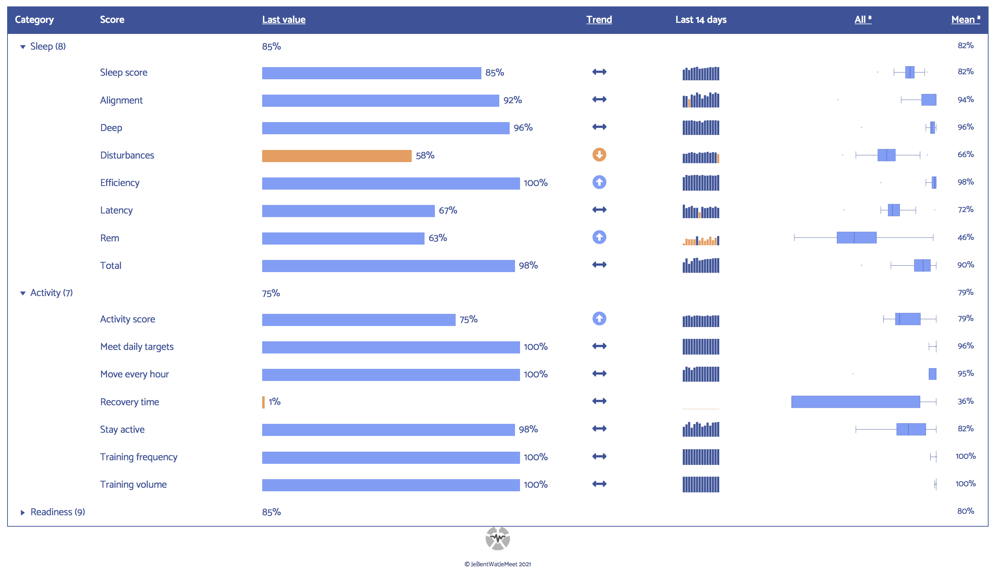

 

# OuraRing

Code for collecting, analyzing and visualizing data from the [Oura Ring](https://ouraring.com).  
You can find a complete Review about the Oura Ring (and a lot of data) on my [Website](https://www.jebentwatjemeet.nl) (in Dutch).

### [Interactive Tables](https://github.com/IreneVDB/OuraRing/tree/master/src/reactable) with `{reactable}` and `{reactablefmtr}`

### [Interactive Charts](https://github.com/IreneVDB/OuraRing/tree/master/src/echarts4r) with `{echarts4r}`

